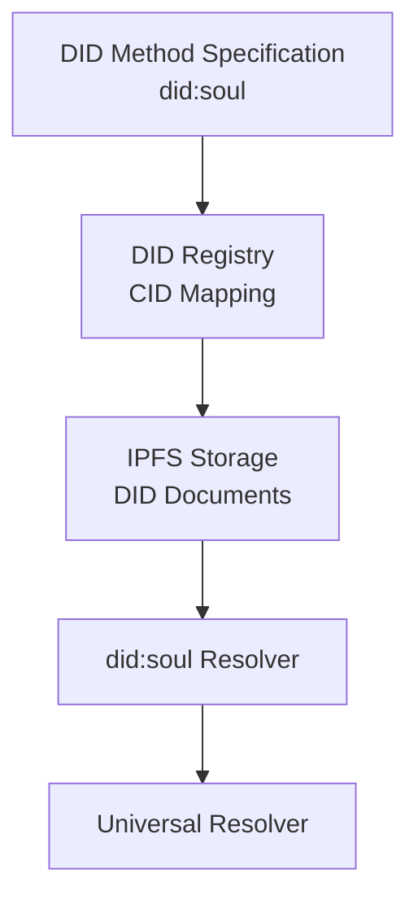

# did:soul - Decentralized Identity

**White Paper v1.1**

### Abstract

This white paper presents `did:soul`, a W3C-compliant Decentralized Identifier (DID) method developed by the Soulverse ecosystem. `did:soul` provides persistent, cryptographically verifiable, self-sovereign identifiers for individuals, organizations, and devices operating within the Soulverse platform. The method leverages Ed25519 asymmetric cryptography managed through a Key Management Service (KMS), content-addressed immutable storage on the InterPlanetary File System (IPFS), and a lightweight registry backed by PostgreSQL. This paper details the problem being solved, the design rationale for each major architectural decision, the full technical specification, deployment model, security considerations, and the primary use cases driving adoption.

---

### Table of Contents

1. [Introduction & Problem Statement](#1-introduction--problem-statement)
2. [Background: Decentralized Identifiers](#2-background-decentralized-identifiers)
3. [did:soul Method Overview](#3-didsoul-method-overview)
4. [DID Method Selection Criteria Evaluation](#4-did-method-selection-criteria-evaluation)
5. [Method Specification](#5-method-specification)
6. [DID Lifecycle Operations](#6-did-lifecycle-operations)
7. [Security Model](#7-security-model)
8. [Deployment](#8-deployment)
9. [Use Cases](#9-use-cases)
10. [References](#10-references)

---

### 1. Introduction & Problem Statement

#### 1.1 The Identity Problem

Modern digital identity systems are overwhelmingly centralized. Whether a user's account lives on a social platform, a government database, or a corporate directory, a single controlling entity holds the authoritative copy of that person's identity. This centralization creates several systemic problems:

- **Vendor lock-in:** Identities are non-portable. Users cannot carry their verified attributes, credentials, or reputation from one platform to another.
- **Single points of failure:** A breach of the identity provider compromises every identity it manages.
- **Loss of privacy:** When identity data is controlled by a central provider, user activities can be tracked and analyzed, reducing personal privacy.
- **Exclusion:** Populations without access to government documents or established credit histories are denied participation in digital economic systems.
- **Revocability:** A platform can, at any time, suspend or delete an account, including all credentials and history associated with it without the user's consent.

#### 1.2 The Soulverse Context
Soulverse is building a decentralized identity ecosystem in which users maintain full sovereignty over their digital identities, no centralized authority required.
For this system to be trustworthy, portable, and interoperable, it must be grounded in a Decentralized Identifier (DID) that meets the following requirements:

- **User-controlled sovereignty:** The identifier is owned and governed exclusively by the user, with no third-party custodianship.
- **Global resolvability:** Any party can resolve the DID independently, without relying on Soulverse infrastructure as a dependency or gatekeeper.
- **Cryptographic verifiability:** The DID Document exposes public keys that enable tamper-evident signing and proof verification.
- **Verifiable Credential (VC) compatibility:** The identifier supports the issuance and verification of credentials by third-party issuers, enabling a rich, trust-layered ecosystem.
- **Persistence:** The identifier remains stable across key rotations and document updates, ensuring long-term continuity of identity.

#### 1.3 Why Not Use an Existing DID Method?

Several established DID methods were considered, including `did:web`, `did:ion`, `did:key`, and `did:ethr`. Each presented trade-offs that made them unsuitable for the Soulverse ecosystem's requirements:

| Method | Key Concern |
|---|---|
| `did:web` | Requires domain ownership; reverts to centralized DNS control |
| `did:key` | Identifier is derived from the current key; key rotation creates a new identity |
| `did:ion` | Relies on Bitcoin Layer 2; high operational cost for high-throughput environments |
| `did:ethr` | Gas costs on Ethereum; public blockchain identity raises privacy concerns for biometric-anchored data |
| `did:indy` | Network-specific; requires participation in a Hyperledger Indy consortium |

`did:soul` was designed from scratch to satisfy the specific requirements of the Soulverse platform: low latency, cloud-native deployment, IPFS-anchored immutability, and KMS-backed cryptographic security.

---

### 2. Background: Decentralized Identifiers

#### 2.1 What is a DID?

A Decentralized Identifier is a URI that:

- Is **globally unique**
- Is **persistent** (does not require a centralized registration authority)
- Is **cryptographically verifiable** (the DID subject can prove control using a private key)
- Is **resolvable** to a **DID Document**, a machine-readable JSON-LD document containing public keys, service endpoints, and metadata

The W3C DID Core 1.0 specification defines the data model and abstract operations for DIDs. Each "DID method" is a specification for how a particular DID scheme creates, resolves, updates, and deactivates identifiers those the CRUD of decentralized identity.

#### 2.2 DID Resolution

A DID resolver takes a DID string as input and returns a **DID Resolution Result** containing:

1. **`didDocument`:** the current DID Document
2. **`didDocumentMetadata`:** operational metadata (version, deactivation status, timestamps)
3. **`didResolutionMetadata`:** resolution process metadata (content type, error codes)

The **DIF Universal Resolver** is an open-source aggregator that routes resolution requests to method-specific drivers based on the DID's method component, enabling any client to resolve any supported DID method through a single, uniform HTTP interface.

#### 2.3 Verifiable Credentials

DIDs serve as the cryptographic anchors for Verifiable Credentials; tamper-evident, machine-verifiable digital equivalents of physical credentials (diplomas, licenses, proofs of identity). A VC issuer signs claims about a subject's DID, and a verifier can use the subject's public key (retrieved by resolving the DID) to verify the signature, entirely without contacting the issuer.

---

### 3. did:soul Method Overview

`did:soul` is a **ledger-free, IPFS-anchored** DID method. It does not write to any blockchain. Instead:

- The **method-specific identifier** is a random UUID, ensuring global uniqueness without collision.
- The **DID Document** is stored on IPFS, providing content-addressed, tamper-evident, immutable storage.
- A **lightweight PostgreSQL registry** maintains the mapping between a DID and the current IPFS Content Identifier (CID) of its document, along with the active KMS key reference.
- **Private keys never leave the KMS**, providing hardware-grade key security.
- The system is **Universal Resolver-compatible** through a dedicated NestJS driver, enabling ecosystem-wide resolution.

```
did:soul:24eab4da-a5e7-40e3-b56a-86632208cc1a
   |       |
   |       +-- Method-Specific Identifier
   +-- Method Name
```
#### DID Resolution Architecture


---

### 4. DID Method Selection Criteria Evaluation

This section evaluates `did:soul` against the comprehensive set of selection criteria drawn from the W3C DID Rubric, DIF DID Traits specification, and broader ecosystem best-practice checklists. Each criterion is rated as follows:


#### 4.1 Specification & Standards Alignment

| # | Criterion | Notes |
|---|---|---|
| 1 | **Alignment with DID Core specification** |  DID syntax, DID Document structure and all five CRUD operations fully follow W3C DID Core 1.0. `didResolutionMetadata`, `didDocumentMetadata` conform to the DID Resolution spec. |
| 2 | **Consider DID Traits (DIF)** | See 5.8 for detailed trait-by-trait assessment. Key traits met: `create`, `resolve`, `update`, `deactivate`, `producible`, `enumerable`. Key traits not yet met: `self-certifying`, `cryptographically-bound`. |
| 3 | **Consider DID Rubric categories (W3C)** | See 5.9 for rubric-by-rubric assessment. Strong on decentralization, security, and persistence. Areas for improvement: governance documentation, controller authentication, offline operation. |

---

#### 4.2 Security & Privacy

| # | Criterion | Notes |
|---|---|---|
| 4 | **Security and privacy features** | Private keys never leave the KMS. DID Documents are publicly accessible on IPFS but contain no biometric or personal data by design. UUID v4 identifiers provide ~2¹²² identifier entropy, preventing enumeration. |
| 5 | **Global government-approved crypto** | Ed25519 is NIST-approved.KMS with `ECC_ED25519` operates under a FIPS 140-2 validated boundary. |
| 6 | **Privacy-preserving crypto** | Ed25519 signatures are deterministic and non-interactive. UUID v4 identifiers are non-correlatable to biometric input. No personal data is embedded in DID Documents. Biometric vectors never appear in the DID layer. |
| 7 | **Digitally signed cryptographic log of changes to the DID Document** | Every DID Document version is permanently stored on IPFS as a content-addressed object, providing an **integrity-guaranteed** history log.|
| 8 | **Revocation and Recovery: Decentralized mechanisms for key rotation and DID recovery** | Key rotation is fully implemented and produces a new DID Document version on IPFS. Deactivation is supported. Recovery (for key loss) is not yet implemented.|

---

#### 4.3 Cryptographic Properties

| # | Criterion  | Notes |
|---|---|---|
| 9 | **Support for key rotation** | Yes dedicatedkey rotation endpoint. Each rotation creates a new key pair, new DID Document version, new IPFS CID, and appends to the DB. Old keys remain discoverable via historical DID Document resolution. |
| 10 | **Long-lived DIDs needed for long-lived VCs** | DID identifiers are permanent UUID v4 strings, they never change after creation. Deactivation is the only terminal state and it is explicit. All historical DID Document states, including historical keys used to sign old VCs, are permanently accessible via IPFS CIDs. |
| 11 | **DIDs are permanent and immutable account identifiers** | The DID string (`did:soul:<uuid>`) is written once and never mutated. The registry enforces this by design (unique constraint on the `did` column; no delete path for the DID itself). |

---

#### 4.4 Performance & Scalability

| # | Criterion | Notes |
|---|---|---|
| 12 | **Scalability and performance** | The backend is a stateless NestJS service, horizontally scalable behind a load balancer. Resolution is a DB lookup + IPFS gateway fetch. Writes involve KMS + IPFS + DB, each independently scalable. KMS handles thousands of signing operations per second. |
| 13 | **Low and predictable marginal cost at scale (millions of accounts)** |At millions of accounts, total cost is dominated by KMS key storage, which can be mitigated by key-sharing across ephemeral DIDs or tiered KMS strategies. |
| 14 | **Ability to create and update identifiers rapidly (within seconds)** | DID creation involves: UUID generation (microseconds), KMS key creation (~100-500ms), IPFS upload (~200-500ms), DB write (~5-20ms). Total: typically under 2 seconds. Updates follow the same profile without KMS key creation (~1 second). |
| 15 | **Reliable and predictable-latency operation, for updating and resolving** | Both the registrar API and resolution path run on SLA-backed infrastructure. IPFS gateway CDN provides globally consistent (300ms) resolution. |
| 16 | **Resolution should not require additional state or context** | A resolver needs only the DID string. No additional anchoring chain, no blockchain headers, no external witnesses. The registry lookup returns the current CID; IPFS returns the document. Versioned resolution requires only the version number (fully self-contained). |

---

#### 4.5 Governance & Sustainability

| # | Criterion  | Notes |
|---|---|---|
| 17 | **Governance: Clear frameworks for updates, dispute resolution, and decision-making** | Governance within Soulverse is informal (engineering team decisions).No inter-organizational governance treaty exists yet. |
| 18 | **Usability: Simple implementation for developers** | REST API with Swagger UI at `/swagger`. Five intuitive endpoints (`POST /dids`, `GET /dids/:did`, `PUT /dids/:did`, `POST /dids/:did/rotate`, `DELETE /dids/:did`). NestJS framework with `class-validator` DTOs. Published README and developer documentation. Universal Resolver integration for standard resolution. |
| 19 | **Sustainability: Energy efficiency and eco-friendly infrastructure** | `did:soul` writes to **no blockchain**, it has zero mining or consensus energy cost. Infrastructure is cloud-native running on shared, energy-optimized data centers. IPFS storage is content-addressed (no duplication). Computational overhead is minimal: a hash, an HTTP upload, and a DB row. |
| 20 | **Who WANTS to standardize the DID method and commits to doing the work?** | Soulverse Engineering Team is committed to the work. Phase 2 roadmap explicitly includes DID Method Spec Publication to the W3C DID Methods Registry. Standardization commitment exists within the organization; external co-sponsors are not yet confirmed. |
| 21 | **Are there no trademark or IP issues?** | The name `did:soul` and the Soulverse branding are owned by Soulverse. The method uses only open standards (W3C DID Core, Ed25519-2020, Multibase, IPFS, UUID v4) with no proprietary protocol dependencies. No known IP conflicts. |

---

#### 4.6 Legal & Regulatory

| # | Criterion | Notes |
|---|---|---|
| 22 | **Compliance with relevant regulations and best practices** | DID Documents contain no personal data, supporting GDPR data-minimisation principles. KMS is the key storage layer, which is SOC 2 / ISO 27001 certified. The architecture is compatible with eIDAS 2.0 wallet frameworks as a DID-backed identity layer. |
| 23 | **Legal Recognition: Cross-border frameworks for DID acceptance** | `did:soul` is designed to be compatible with the W3C VC Data Model, making credentials portable across any VC-aware jurisdiction. Legal recognition of DID-based identity varies significantly by country. |

---

#### 4.7 Operational & Ecosystem Criteria

| # | Criterion | Notes |
|---|---|---|
| 24 | **Community adoption and support** |Currently adopted within the Soulverse ecosystem . Universal Resolver integration provides visibility to the broader DID community. External community adoption is nascent; publication of the formal method spec is the key enabler. |
| 25 | **Scope / domain of entity types addressed** |The method is generic, any entity can hold a `did:soul`. The method-specific identifier (UUID) imposes no semantic restriction on subject type. |
| 26 | **Emerging Markets: Offline-friendly, low-bandwidth** | DID creation and update require internet connectivity. Resolution of a locally cached DID Document is possible offline; IPFS clients can serve cached content peer-to-peer. |
| 27 | **Diversity: At least one fully decentralized DID method** | `did:soul` is **partially decentralized**: DID Documents are stored on the decentralized IPFS network and readable by anyone; the Universal Resolver is a neutral aggregator. However, the **registry** and **KMS** are centralized infrastructure. |

---

#### 4.8 DIF DID Traits Assessment

Based on the [DIF DID Traits specification](https://identity.foundation/did-traits/):

| Trait  | Notes |
|---|---|
| `create` | `POST /dids` - creates a new DID with Ed25519 keys |
| `resolve` |  Direct API + Universal Resolver driver |
| `update` |  `PUT /dids/:did` - updates service endpoints and verification methods |
| `deactivate` |  `DELETE /dids/:did` - sets deactivated flag |
| `key-rotation` | `POST /dids/:did/rotate` - generates new KMS key pair |
| `versioned-resolution` |  `?version=n` parameter; all historical states on IPFS |
| `globally-unique` |  UUID v4 provides statistical uniqueness |
| `persistent` |  DID string never changes; historical documents immutable on IPFS |
| `decentralized-registration` | IPFS storage is decentralized; registry is centralized |
| `service-endpoints` | `service` field supported in DID Document updates |
| `multiple-verification-methods`| Currently one active key per rotation; multiple methods supported by the interface spec |

---

#### 4.9 W3C DID Rubric Assessment

Based on the [W3C DID Rubric](https://www.w3.org/TR/did-rubric/), key rubric areas and their ratings:

| Rubric Category  | Notes |
|---|---|
| **Decentralization of Governance**  | Method governance is currently internal to Soulverse; no formal external governance body |
| **Decentralization of Registry** | DID Documents on IPFS (decentralized); CID-to-DID index on DB (centralized) |
| **Cryptographic Verifiability** | Ed25519 keys; DID Documents signed via KMS; public key in multibase |
| **DID Document Immutability** | IPFS content-addressing; historical CIDs never change |
| **Method Specification Quality** | Internal documentation exists; formal W3C-registered spec not yet published |
| **Privacy** | No PII in DID Documents; non-correlatable identifiers; no on-chain data |
| **Security** | HSM-backed keys; FIPS-certified KMS; content-addressed document integrity |
| **Scalability** | Stateless services; CDN-cached IPFS resolution; horizontal scaling |
| **Interoperability** | Universal Resolver compatible; W3C DID Core compliant; VC-ready |
| **Sustainability** | No blockchain; cloud-native energy-optimized infrastructure |
| **Usability** | REST API + Swagger; clear error codes; versioned resolution |
| **Governance Transparency** | No public governance charter yet; planned for spec publication phase |

---

### 5. Method Specification

#### 5.1 DID Syntax

```
did-soul         = "did:soul:" soul-specific-idstring
soul-specific-id = UUID v4 (RFC 4122)
```

**Example:**
```
did:soul:24eab4da-a5e7-40e3-b56a-86632208cc1a
```

The method-specific identifier is a UUID v4 with the canonical lowercase hyphenated form as specified by RFC 4122.

#### 5.2 DID Document Structure

A `did:soul` DID Document is a W3C DID Core 1.0 compliant JSON-LD document:

```json
{
  "@context": [
    "https://www.w3.org/ns/did/v1",
    "https://w3id.org/security/suites/ed25519-2020/v1"
  ],
  "id": "did:soul:24eab4da-a5e7-40e3-b56a-86632208cc1a",
  "controller": "did:soul:24eab4da-a5e7-40e3-b56a-86632208cc1a",
  "verificationMethod": [
    {
      "id": "did:soul:24eab4da-a5e7-40e3-b56a-86632208cc1a#keys-1",
      "type": "Ed25519VerificationKey2020",
      "controller": "did:soul:24eab4da-a5e7-40e3-b56a-86632208cc1a",
      "publicKeyMultibase": "z6MkpTHR8VNsBxYAAWHut2Geadd9jSwuias8sitwspLwt638"
    }
  ],
  "authentication": [
    "did:soul:24eab4da-a5e7-40e3-b56a-86632208cc1a#keys-1"
  ],
  "assertionMethod": [
    "did:soul:24eab4da-a5e7-40e3-b56a-86632208cc1a#keys-1"
  ],
  "created": "2026-03-23T10:00:00.000Z",
  "updated": "2026-03-23T10:00:00.000Z"
}
```

**Field constraints:**

| Field | Constraint |
|---|---|
| `@context` | Always includes W3C DID v1 context and Ed25519-2020 suite context |
| `id` | Always the `did:soul:<uuid>` string; never changes |
| `controller` | Always self-referential (the DID controls itself) |
| `verificationMethod[].id` | Format: `<did>#keys-<version>`, increments on each key rotation |
| `publicKeyMultibase` | Multibase base58btc (`z` prefix) with Ed25519 multicodec prefix (`0xed01`) |
| `authentication` | Reference list pointing to active verification method IDs |
| `assertionMethod` | Reference list pointing to active verification method IDs |


---
### 6. DID Lifecycle Operations

The `did:soul` method supports the standard lifecycle operations defined by the DID ecosystem, enabling identifiers to be created, resolved, updated, rotated, and deactivated while maintaining identifier persistence and document version history.

#### 6.1 Create

A new `did:soul` identifier is generated together with its associated cryptographic key pair. A DID Document is created in accordance with the W3C DID Core specification and published to decentralized storage. The DID becomes immediately resolvable through the `did:soul` resolution infrastructure.

#### 6.2 Resolve

A `did:soul` identifier can be resolved to its corresponding DID Document. Resolution returns the current DID Document and associated metadata, enabling verification of public keys, services, and other DID-related information.

#### 6.3 Update

DID Documents may be updated to reflect changes such as service endpoints or verification relationships. Each update results in a new version of the DID Document while preserving prior versions for auditability and historical verification.

#### 6.4 Key Rotation

The controller of a DID may replace an existing cryptographic key with a new key. Key rotation updates the DID Document without changing the DID itself, allowing long-term identifier continuity while maintaining cryptographic security.

#### 6.5 Deactivate

A DID may be deactivated by its controller. Once deactivated, the DID is no longer considered active and cannot be used for future updates. Historical DID Document versions remain available for verification of previously issued signatures and credentials.

---

### 7. Security Model

#### 7.1 Key Security

Private keys never appear in the `did-soul-backend` application code or database. The KMS is the exclusive holder of private key material:

- **KMS** stores keys in FIPS 140-2 Level 3 Hardware Security Modules (HSMs).
- All signing operations occur **inside** the KMS, the application provides data to be signed but never handles the raw private key.
- All KMS operations are logged.

#### 7.2 DID Document Integrity

DID Documents stored on IPFS are content-addressed by their hash (CID). Any modification of the document would produce a different CID. The registry's pointer is the authoritative reference to the current document. Since IPFS guarantees the document at a given CID is immutable, a valid CID pointer always resolves to the exact document originally stored.

#### 7.3 Threat Model

| Threat | Mitigation |
|---|---|
| **Registry database compromise** | Attacker can read CID pointers and DID metadata, but cannot modify IPFS content (CIDs are hash-locked). Signing keys in KMS are not exposed. |
| **IPFS content availability** | CID-based linking means availability does not depend on file names or paths. |
| **Replay attacks** | Key rotation versioning ensures that signatures made by a replaced key are clearly associated with a specific historical version. |


#### 7.4 Privacy Considerations

- The DID generation is entirely random, ensuring no correlation between the identifier and the user's physical characteristics.
- DID Documents stored on IPFS are **publicly accessible** by any party who knows the CID. No personal or biometric information should be included in the DID Document itself.
- Service endpoints and associated attributes should be curated carefully to minimize unnecessary data exposure.
- `did:soul` does not support on-chain writing, eliminating privacy risks associated with persistent blockchain ledgers.

---

### 8. Deployment

The `did:soul` ecosystem is designed to be deployed as a set of modular services that support DID creation, resolution, and lifecycle management.

#### 8.1 Backend Services

The `did:soul` backend services are deployed on managed server infrastructure and expose the APIs required for DID lifecycle operations, DID resolution, and integration with external applications.

#### 8.2 Universal Resolver Driver

The `did:soul` Universal Resolver driver is packaged as a Docker container, enabling standardized deployment across cloud, on-premises, and container orchestration environments. The container image is published through Docker Hub and can be integrated directly with Universal Resolver deployments.

#### 8.3 Decentralized Storage

DID Documents are published to decentralized storage, ensuring persistent access and content-addressable retrieval independent of any single application server.

#### 8.4 Deployment Characteristics

The deployment model provides:

* Containerized and portable infrastructure
* Independent scaling of backend services
* Integration with Universal Resolver ecosystems
* Persistent DID Document availability
* Support for cloud and self-hosted deployments

---

### 9. Use Cases


#### 9.1 Verifiable Credential Issuance

**Context:** An organization (university, employer, government agency) issues credentials to Soulverse users.

**DID Role:** The issuer uses the user's `did:soul` as the credential subject identifier. The credential is signed with the issuer's own DID-linked key. Verifiers resolve the user's `did:soul` to obtain their public key and verify credential presentation signatures.

**Example credential binding:**
```json
{
  "@context": ["https://www.w3.org/2018/credentials/v1"],
  "type": ["VerifiableCredential", "UniversityDegreeCredential"],
  "credentialSubject": {
    "id": "did:soul:24eab4da-a5e7-40e3-b56a-86632208cc1a",
    "degree": { "type": "BachelorOfScience", "name": "Computer Science" }
  }
}
```

#### 9.2 Cross-Platform Authentication (SSI-Based Login)

**Context:** Third-party applications wish to authenticate Soulverse users without passwords or centralized identity providers.

**DID Role:** The user presents a Verifiable Presentation signed with their `did:soul` private key (via KMS). The verifier resolves the DID, retrieves the public key, and verifies the presentation signature, no call to Soulverse is required.

**Benefits:**
- No shared secrets or passwords.
- **Selective disclosure** - users present only the credentials relevant to the interaction.
- Verifiers have cryptographic proof of claims without needing to trust Soulverse.

#### 9.3 Organizational Identities

**Context:** Organizations operating within the Soulverse ecosystem need machine-verifiable identities for issuing credentials, signing documents, and authenticating API clients.

**DID Role:** An organization's `did:soul` anchors its public keys and service endpoints. Rotation of organizational keys does not change the organization's persistent identifier, simplifying key lifecycle management.

#### 9.4 IoT Device Identity

**Context:** Physical devices (access control terminals, biometric scanners, wallet hardware) require verifiable identities for secure communication and audit.

**DID Role:** Each device is provisioned a `did:soul`, with its public key stored in the DID Document. Device-to-device communication can be authenticated using DIDComm, with mutual DID resolution ensuring neither party needs pre-shared secrets.

#### 9.5 Historical Credential Audit

**Context:** Regulated domains (financial services, healthcare) require proof that a credential was valid at a specific past date.

**DID Role:** Because every version of a DID Document is permanently and immutably stored on IPFS, verifiers can resolve a historical DID Document version to confirm that a specific key was active at the time a credential was signed, even after subsequent key rotations.

---

### 10. References

| Reference | URL |
|---|---|
| W3C DID Core 1.0 | https://www.w3.org/TR/did-core/ |
| W3C DID Resolution | https://w3c-ccg.github.io/did-resolution/ |
| DIF Universal Resolver | https://github.com/decentralized-identity/universal-resolver |
| AWS KMS Ed25519 | https://docs.aws.amazon.com/kms/latest/developerguide/asymmetric-key-specs.html |
| W3C Verifiable Credentials | https://www.w3.org/TR/vc-data-model/ |
| DIF DID Traits | https://identity.foundation/did-traits/ |
| W3C DID Rubric | https://www.w3.org/TR/did-rubric/ |

---
